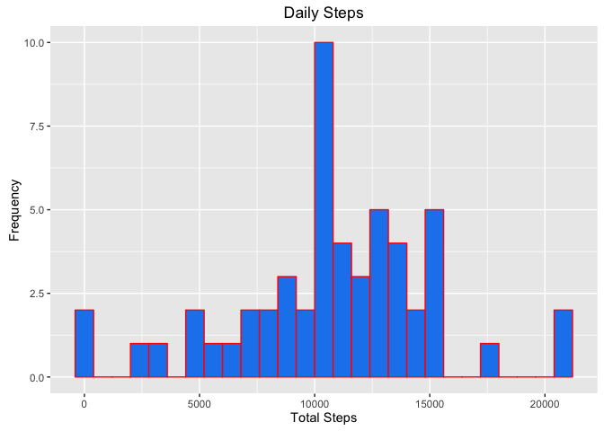
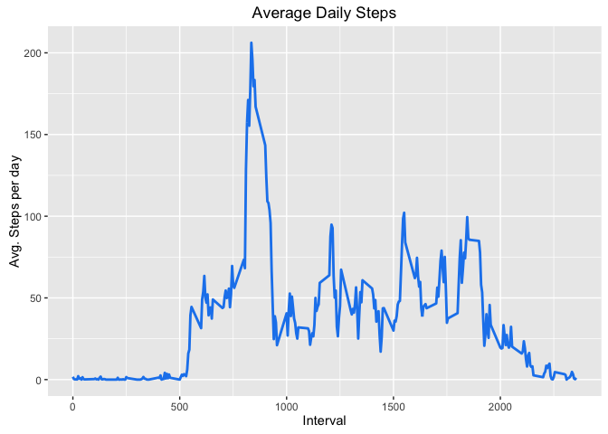
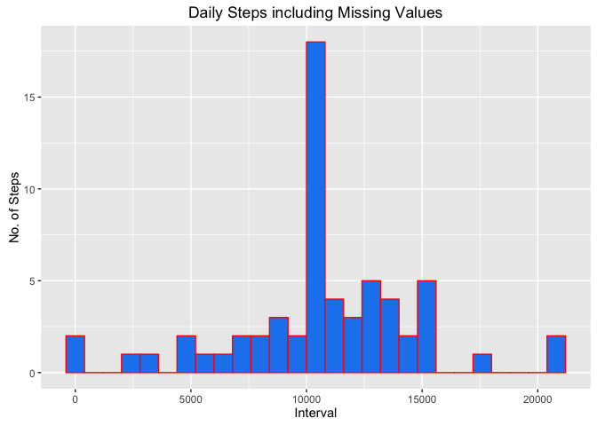
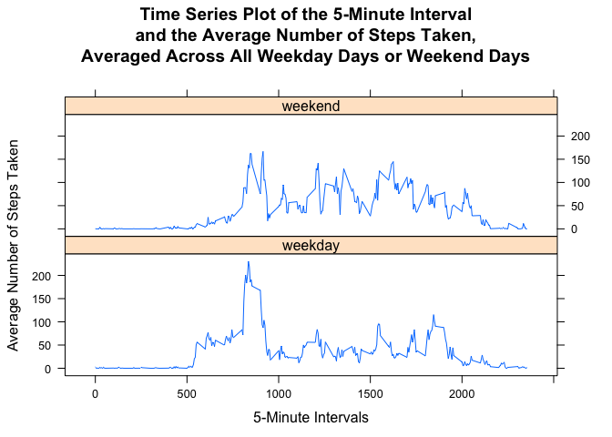

```{r setup, include=FALSE}
knitr::opts_chunk$set(echo = TRUE)
```
As John Chambers said:
> Everything is a function.


### Loading and preprocessing the data

##### Load Packages

```{r}
library(dplyr)
library(ggplot2)
library(knitr)
```

##### Load the data from the .csv file and run str() to determine the classes of data included in the dataset

```{r}
act <- read.csv("activity.csv")
str(act)
```

### What is mean total number of steps taken per day?
##### Caluculate the total number of steps per day

```{r}
total_steps <- act %>% 
  group_by(date) %>%
  filter(!is.na(steps)) %>%
  summarise(total_steps = sum(steps, na.rm= TRUE))
```

```{r}
total_steps
```

##### Create a histogram in ggplot2 to visualize the data

```{r}
ggplot(total_steps, aes(x= total_steps)) +
geom_histogram(fill= "dodgerblue2", color= "red", binwidth = 800) +
labs(title= "Daily Steps", x= "Total Steps", y= "Frequency")
```


##### Calculate the mean and median of the total number of steps taken daily

```{r}
summary(total_steps$total_steps)
```

### What is the average daily pattern?

```{r}
daily <- act %>%
group_by(interval) %>%
filter(!is.na(steps)) %>%
summarise(avg_steps = mean(steps, na.rm = TRUE))
```

```{r}
daily
```

##### Make a time series plot of the 5 minute interval(x-axis) and the average number of steps taken, averaged across all days (y-axis)

```{r}
ggplot(daily, aes(x= interval, y= avg_steps)) +
geom_line(color= "dodgerblue2", size= 1) +
labs(title= "Average Daily Steps", x= "Interval", y= "Avg. Steps per day")
```



##### Which 5-minute interval, on average across all the days in the dataset, contains the maximum number of steps?

```{r}
daily[which.max(daily$avg_steps),]
```

### Imputing missing values

##### Calculate and report the total number of missing values in the dataset (i.e. the total number of rows with 𝙽𝙰s)

```{r}
sum(is.na(act$steps))
```

##### Devise a strategy for filling in all of the missing values in the dataset. 
##### Create a new dataset that is equal to the original dataset but with the missing data filled in.

```{r}
act2 <- act
nas <- is.na(act$steps)
avg_interval <- tapply(act2$steps, act2$interval, mean, na.rm= TRUE, simplify = TRUE)
act2$steps[nas] <- avg_interval[as.character(act2$interval[nas])]
names(act2)
```

##### Check if no missing values are present

```{r}
sum(is.na(act2))
```

##### Reorder columns

```{r}
act2 <- act2[, c("date", "interval", "steps")]
head(act2)
```

### Make a histogram of the total number of steps taken each day and Calculate and report the mean and median total number of steps taken per day. 

```{r}
total_steps2 <- act2 %>%
group_by(date) %>%
summarise(total_steps = sum(steps, na.rm = TRUE))
total_steps2
```


```{r}
ggplot(total_steps2, aes(x= total_steps)) +
  geom_histogram(fill= "dodgerblue2", color= "red", binwidth = 800) +
  labs(title= "Daily Steps including Missing Values", x= "Interval", y= "No. of Steps")
```

##### Make a histogram of the total number of steps taken each day and Calculate and report the mean and median total number of steps taken per day. Do these values differ from the estimates from the first part of the assignment? What is the impact of imputing missing data on the estimates of the total daily number of steps?

```{r}
MS2 <- mean(total_steps2$total_steps, na.rm = TRUE)
MS2
```

```{r}
MDS2 <- median(total_steps2$total_steps, na.rm = TRUE)
MDS2
```

##### When you input the missing values, both the mean and median are the same, 10766.19

### Are there differences in activity patterns between weekdays and weekends?

##### Create a new factor variable in the dataset with two levels – “weekday” and “weekend” indicating whether a given date is a weekday or weekend day.

```{r}
act2$date <- as.Date(act2$date)
act2$day <- weekdays(act2$date)
act2$indicate_day <- as.factor(ifelse(act2$day == "Saturday" |
act2$day == "Sunday", "weekend", "weekday"))
```

##### Check data

```{r}
head(act2)
```

```{r}
newinterval <- aggregate(act2$steps ~ act2$interval + act2$indicate_day, act2, mean)
```

##### Rename Variables

```{r}
names(newinterval) [3] <- "mean_steps"
names(newinterval) [2] <- "daytype"
names(newinterval) [1] <- "interval"
```

##### Make a panel plot containing a time series plot (i.e. 𝚝𝚢𝚙𝚎 = "𝚕") of the 5-minute interval (x-axis) and the average number of steps taken, averaged across all weekday days or weekend days (y-axis).

```{r}
library(lattice)
xyplot(
  mean_steps ~ interval | daytype,
  newinterval,
  type = "l",
  layout = c(1,2),
  main = "Time Series Plot of the 5-Minute Interval\nand the Average Number of Steps Taken,\nAveraged Across All Weekday Days or Weekend Days",
  xlab = "5-Minute Intervals",
  ylab = "Average Number of Steps Taken"
)
```



### Conclusion

#### There is a difference between the "weekend" and "weekday" average amounts of steps taken. The weekday steps peak at about the 800-1000 interval, while the weekend steps are more evenly spread out from about theb 750-2000 interval. 
